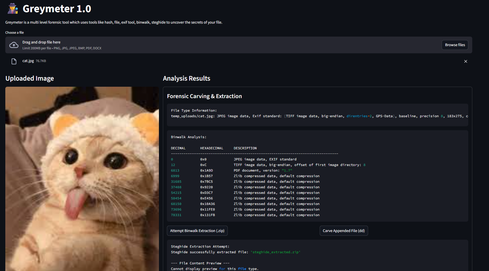

````markdown
# 🕵️ Greymeter 1.0

During my internship at *Broskieshub.com* as soluton of problem number 18 I created this all-in-one, web-based **digital forensics tool** designed to detect, analyze, and extract hidden data from files.  
This application leverages a suite of classic forensic tools and Python libraries, all packaged within a **Docker container** for easy, cross-platform use.



---

## 📋 Core Features

This tool provides a **multi-layered analysis** approach, combining several techniques to uncover hidden data:

- **File Integrity Verification:** Instantly calculates MD5, SHA1, and SHA256 hashes to verify file integrity.  
- **Metadata Analysis:** Extracts and displays EXIF metadata from JPEG/JPG images to find clues about the image's origin and potential modifications.  
- **Steganography Extraction (steghide):** Integrates the powerful *steghide* tool to extract hidden payloads/files from JPEG/JPG files and provides a direct download for the extracted file.  
- **File Concatenation Detection (binwalk):** Uses *binwalk* to scan for multiple embedded file signatures, effectively detecting files that have been appended to one another.  
- **Forensic Carving (dd):** Intelligently parses *binwalk*’s output to surgically "carve" appended files from their exact offset, recovering the full hidden file.  
- **Automated File Identification:** Automatically detects the true file type of any extracted or carved data using its *magic bytes* and assigns the correct file extension, making them immediately usable.  

---

## 🛠️ Tech Stack
- **Ai:** Gemini (code), ChatGPT (for)
- **Backend:** Python  
- **Frontend:** Streamlit  
- **Forensic Tools:** steghide, binwalk, file, dd, exiftool 
- **Core Libraries:** Pillow, numpy  
- **Containerization:** Docker & Docker Compose  

---

## 🚀 Getting Started: Running the Application

This entire application is containerized with **Docker**, which means you do not need to install Python or any dependencies on your host machine.

### 🔧 Prerequisites

You must have Docker installed and running on your system.

- **Windows/macOS:** Install **Docker Desktop**  
- **Linux:** Install **Docker Engine** and **Docker Compose**

---

## ▶️ Instructions for Windows Users

  
### 1. Clone the Repository

Open **PowerShell** clone this project's repository:

```bash
git clone https://github.com/ultrew/
````

### 2. Navigate to the Project Directory

```bash
cd Greymeter
```

### 3. Build the Docker Image

This command reads the Dockerfile, installs the Linux environment, all forensic tools, and builds the application.
It may take several minutes on the first run.

```bash
docker compose build
```

### 4. Run the Application

```bash
docker compose up
```

### 5. Access the Web App

Open your browser and go to:

👉 **[http://localhost:8501](http://localhost:8501)**

### 6. Stop the Application

To stop the running container, press **Ctrl + C** in the terminal.
To remove the container afterward, run:

```bash
docker compose down
```

---

## ▶️ Instructions for Linux Users (Debian/Ubuntu)

### 1. Clone the Repository

Open your terminal and clone this project:

```bash
git clone https://github.com/ultrew/AI-Stego-Detector.git
```

### 2. Navigate to the Project Directory

```bash
cd Greymeter
```

### 3. Build the Docker Image

This command reads the Dockerfile, installs the environment and forensic tools, and builds the application image.
This may take several minutes on the first run.

```bash
sudo docker compose build
```

### 4. Run the Application

```bash
sudo docker compose up
```

### 5. Access the Web App

Open your browser and go to:

👉 **[http://localhost:8501](http://localhost:8501)**

### 6. Stop the Application

To stop the running container, press **Ctrl + C**.
To remove it afterward:

```bash
sudo docker compose down
```

---

## 🔧 Troubleshooting ()

* **`docker-compose: command not found`**
  → Newer Docker versions use `docker compose` (with a space).
  If that fails, try `docker-compose` (with a hyphen).

* **Network Error during Build (`apt-get update` failed)**
  → The container cannot access the internet. Restart Docker Desktop or set a DNS (e.g., `8.8.8.8`) in Docker settings.

* **Permission Denied (Linux)**
  → Your user is not in the Docker group.
  Run all commands with `sudo`

---

## 📁 Project Structure

```
Greymeter/
│
├── Screenshots/            # Screenshot of the app
├── outputs/                # Folder where reports would be generated
├── sample_images/          # Folder for your test images
├── README.md               # Project documentation
├── requirements.txt        # Python library dependencies
├── app.py                  # Main Streamlit frontend application
├── stego_detector.py       # Core backend logic for all forensic tools
├── docker-compose.yml      # Easy-to-use script to build and run the app
├── report_generator.py     # Final report genrator 
└── Dockerfile              # Blueprint for the Docker container
```

---

End of report.